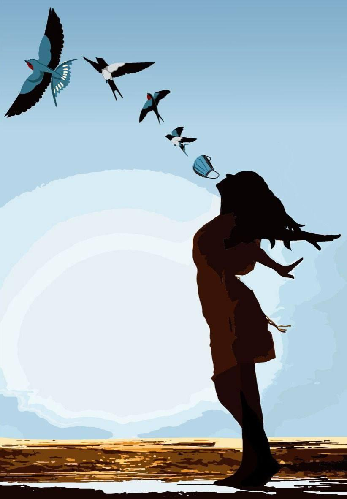

## Welcome to The Vuka Sandbox

Space to share ideas and content

link to actual site [VUKASA](https://vukasa.org.za)

## Beautiful voice clip

 <audio controls>
  <source src="/pdfs/PTT-20220303-WA0653.opus" type="audio/ogg">
Your browser does not support the audio element.
</audio> 

## Call to Reason

<object data="pdfs/hcpscall2stopmandates.pdf" type="application/pdf" width="100%" height="700px">
    <embed src="pdfs/hcpscall2stopmandates.pdf">
        
This browser does not support PDFs. Please download the PDF to view it: <a href="http://yoursite.com/the.pdf">Download PDF</a>.

    </embed>
</object>

<!-- <iframe src="pdfs/hcpscall2stopmandates.pdf" width="100%" height="500px">
< -->/iframe>

## Text for voice clip above

Uke wadibana neengxaki ezingenantsusa nezingaqhelekanga kwimpilo yakho emva kokufumana ugonyo lwe Covid-19?

Uke wafumana ukulima komzimba okuguqule ubomi bakho nendlela ophila ngayo emva kogonyo?

Uke wabhujelwa ngumntu omthandayo ngesaquphe ngenxa okanye emva kokuba begonyile?

Ukuba uphendule ngo ewe noba kukomphi kule mibuzo ingentla, sifuna ukuva ibali lakho!

I-VUKA SA liphulo elibhexeshwa ngu Dr Kat (Naseeba Kathrada, umseki weqela iCaring Healthcare Workers Coalition nokwangumhlali ngaphambili we Health and Humanity Committee of the World Council for Health ekunye nonozakuzaku abangaphaya kwamawaka amabini banenjongo yokuphakamisa kwaye baxhobise abemi bomMzantsi Africa ngokunabisa indlela zokufumana ulwazi olungahluzwanga.

Siyi VUKA SA sifuna wazi ukuba awukho wedwa kwaye injongo yethu kukubuyisela ilizwi elivakalayo kubantu bezwe lethu.

Sisonke, Somelele!

Silinde ukuthetha nawe kule minxeba ilandelayo

Katja – 084 207 7286

Dennis – 083 285 7549

Email – TestamoniesProjectSA@protomail.com

